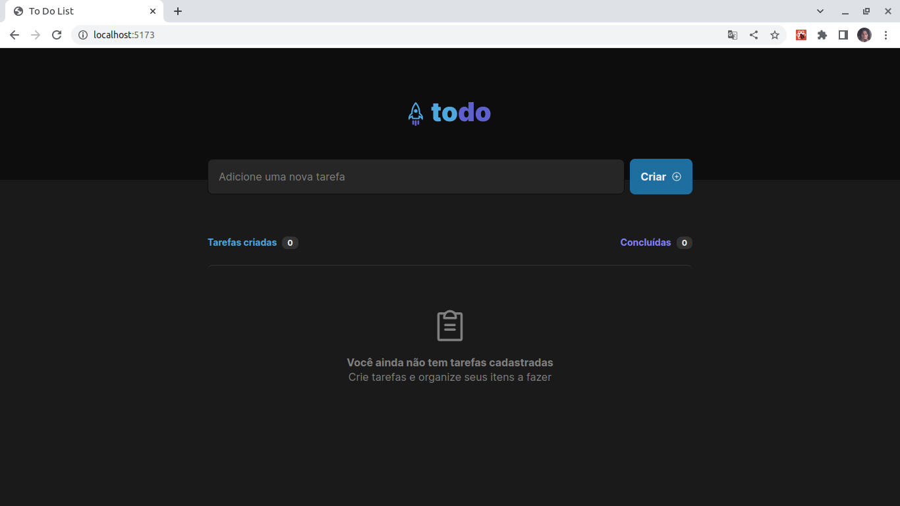
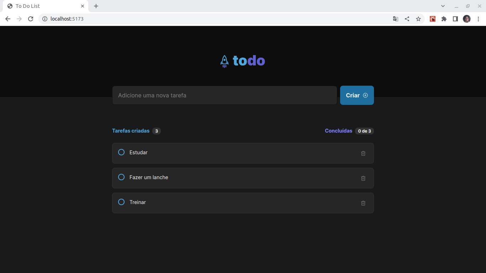
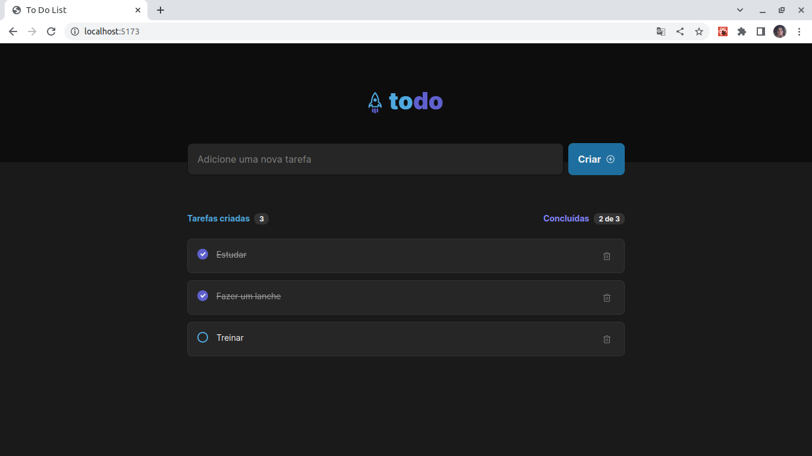

<h1 align="center">
  
</h1>

## Primeiro Acesso
### Clonando o projeto
```
$ git clone https://github.com/matheusfd3/to-do-list-reactjs-2.0.git
```
### Baixando as dependências
Na pasta do projeto execute o comando abaixo com o npm.
```
$ npm install
```
### Rodando no localhost
```
$ npm run dev
```
### **Imagem**
<h2 align="center">
  
</h2>
<h2 align="center">
  
</h2>
<h2 align="center">
  
</h2>